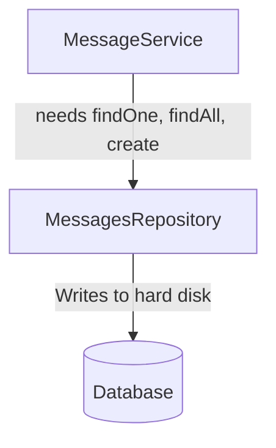
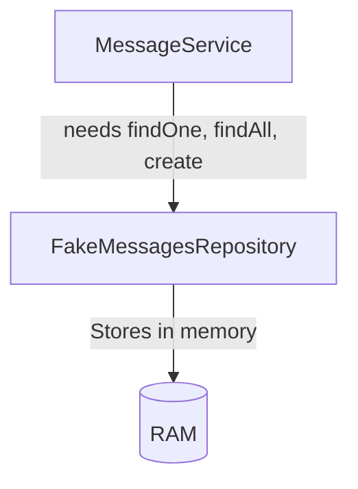

## 🧠 Inversion of Control (IoC) Principle

### 🔹 Definition

**Classes should not create instances of their dependencies on their own.**

Instead, dependencies should be **provided (injected)** to them from the outside.

---

### ⚠️ Why we avoid creating dependencies inside the class

* Tight coupling → Harder to test and maintain
* Difficult to swap or mock dependencies
* Reduces flexibility and reusability

---

### 💡 Better Way (Dependency Injection)

Instead of creating the repository inside the service class:

```ts
export class MessageService {
  messageRepo: MessagesRepository;

  constructor(repo: MessagesRepository) {
    this.messageRepo = repo;
  }
}
```

Now `MessageService` **receives** its dependency, instead of creating it.

---

### ✅ Best Way — Use an Interface (Abstraction)

```ts
interface Repository {
  findOne(id: string);
  findAll();
  create(content: string);
}

export class MessageService {
  messagesRepo: Repository;

  constructor(repo: Repository) {
    this.messagesRepo = repo;
  }
}
```

Now `MessageService` doesn’t depend on a **specific implementation**, just the **contract (interface)**.

---

### 💬 Why This Is the Best

* Supports **Dependency Inversion Principle (DIP)**
* **Testable:** You can inject fake or mock repositories
* **Flexible:** Works with different data sources (DB, in-memory, etc.)
* **Reusable:** The service doesn’t care *how* data is stored

---

### 🧩 In Production



* **MessagesRepository** is slow but persistent
* Real implementation for actual app behavior

---

### 🧪 In Automated Tests



* **FakeMessagesRepository** is fast and doesn’t write to disk
* Perfect for unit testing

---

### 🔁 Summary

| Case   | Dependency Type         | Coupling | Testability | Flexibility |
| ------ | ----------------------- | -------- | ----------- | ----------- |
| Bad    | Created inside class    | High     | Low         | Low         |
| Better | Injected concrete class | Medium   | Medium      | Medium      |
| Best   | Injected via interface  | Low      | High        | High        |


## ⚙️ Dependency Injection (DI) Container Flow

### 🔹 What happens behind the scenes

1. **At startup**, all classes are **registered** with the container.
2. The **DI container analyzes** what dependencies each class needs.
3. When you request an instance of a class,
   the **container automatically creates it** — including all required dependencies.
4. The container **stores created instances** (singletons) and **reuses them** when needed.
5. If you ever need a *fresh instance* instead of a shared one, the container can do that too.

---

### 🧩 Example: Refactoring to use Dependency Injection (NestJS)

**message.service.ts**

```ts
import { Injectable } from '@nestjs/common';

@Injectable()
export class MessageService {
  // Service logic here
}
```

**message.repository.ts**

```ts
import { Injectable } from '@nestjs/common';

@Injectable()
export class MessagesRepository {
  // Repository logic here
}
```

**messages.module.ts**

```ts
import { Module } from '@nestjs/common';
import { MessagesService } from './messages.service';
import { MessagesRepository } from './messages.repository';
import { MessagesController } from './messages.controller';

@Module({
  controllers: [MessagesController],
  providers: [MessagesService, MessagesRepository],
})
export class MessagesModule {}
```

---

### 🧠 Behind the scenes in NestJS

* When your app starts, NestJS **registers all providers** (services, repositories, etc.) in its DI container.
* When something (like a controller) asks for `MessageService`,
  the container checks if it already has one —
  if yes → returns the same instance (singleton).
  if no → creates one and injects all its dependencies.

---

### ♻️ Shared Instances

* By default, the same instance is **shared across the app** (Singleton Scope).
* If you need a **new instance each time**, you can configure that later using scopes
  (like *Transient* or *Request* scope).

---

### 💰 The $1M Question: *“Why do all this when Express works fine?”*

✅ **Answer:**
Because this approach gives **testable, maintainable, and decoupled code**.

Here’s the breakdown:

| Feature               | Express (Manual DI)   | NestJS (With DI Container) |
| --------------------- | --------------------- | -------------------------- |
| Dependency Management | Manual                | Automatic                  |
| Testing               | Hard (manual mocking) | Easy (fake injectables)    |
| Reusability           | Low                   | High                       |
| Scaling large apps    | Difficult             | Cleanly structured         |
| Code coupling         | High                  | Low                        |

---

### 🧩 Summary Thought

> “It feels like extra setup at first… but pays off massively when your project grows or when you start writing automated tests.”
