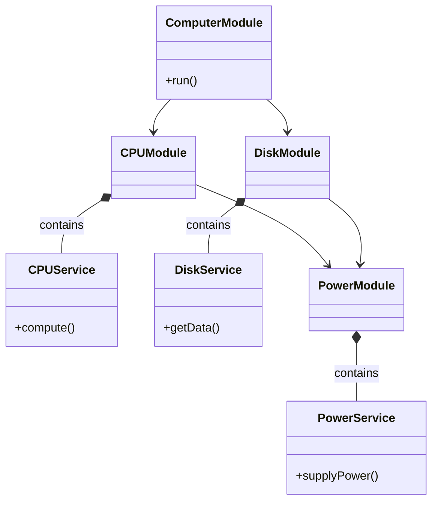

```mermaid
classDiagram
    class PowerModule {
    }

    class PowerService {
        +supplyPower()
    }

    class CPUModule {
    }

    class CPUService {
        +compute()
    }

    PowerModule --> PowerService : exports
    CPUModule --> CPUService
    CPUModule --> PowerModule : imports
    CPUService --> PowerService : injects

    note right of CPUService
        1. Add PowerService to PowerModule's exports
        2. Import PowerModule into CPUModule
        3. Inject PowerService into CPUService constructor
    end note
```