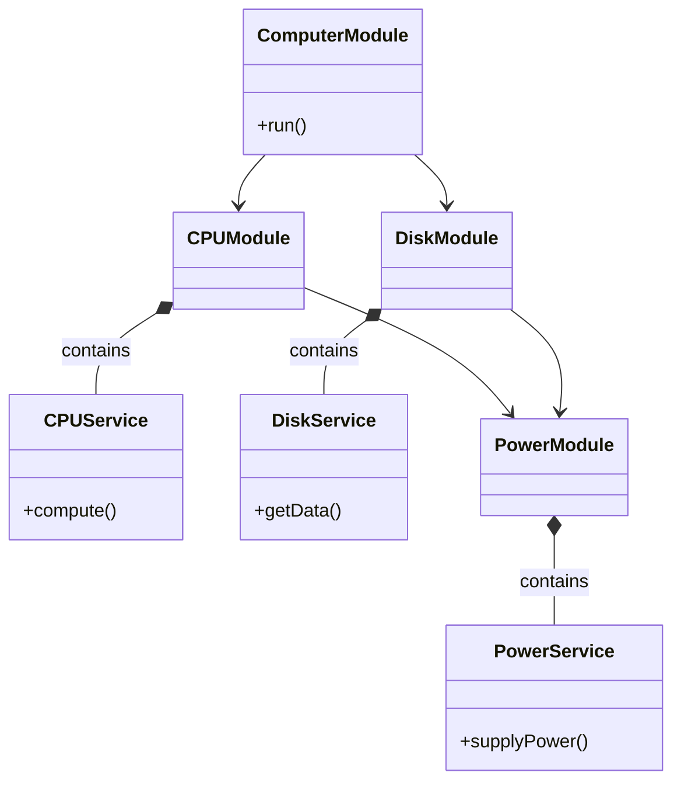

```text
+------------------+         +------------------+
|   Power Module   |         |    CPU Module    |
|------------------|         |------------------|
| PowerService     |         | CpuService       |
| supplyPower()    |         | compute()        |
+--------+---------+         +--------+---------+
         |                              ^
         |   inject PowerService        |
         +------------------------------+

Steps:
1. Add PowerService to PowerModule's exports
2. Import PowerModule into CpuModule
3. Inject PowerService into CpuService constructor
```
