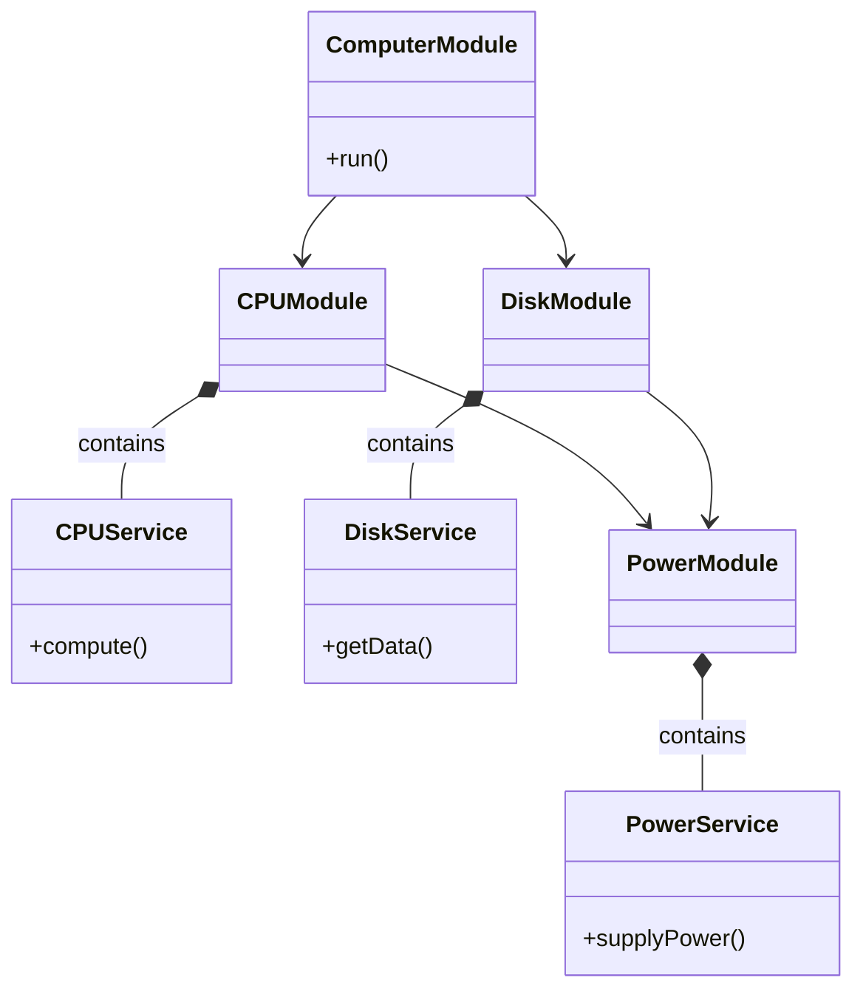

```mermaid
flowchart LR
    subgraph PowerModule["Power Module"]
        PS["Power Service\nsupplyPower()"]
    end

    subgraph CpuModule["CPU Module"]
        CS["CPU Service\ncompute()"]
    end

    %% Connections
    PS --> CS

    %% Dependency direction
    PowerModule --> CpuModule

    %% Notes section
    note right of CS
        1. Add PowerService to PowerModule exports
        2. Import PowerModule into CpuModule
        3. Inject PowerService into CpuService constructor
    end note
```
