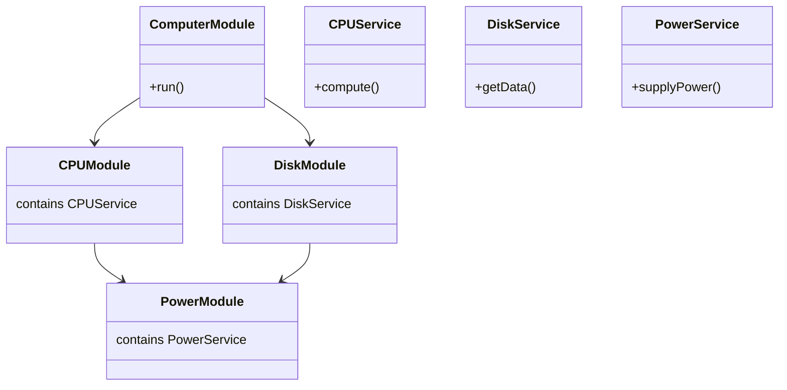

```mermaid
classDiagram
    class PowerModule {
    }

    class PowerService {
        +supplyPower()
    }

    class CpuModule {
    }

    class CpuService {
        +compute()
    }

    PowerModule --> PowerService : exports
    CpuModule --> CpuService
    CpuService --> PowerService : injects

    %% Steps Description
    note bottom of CpuService
        1. Add PowerService to PowerModule's exports
        2. Import PowerModule into CpuModule
        3. Inject PowerService into CpuService constructor
    end note
```

